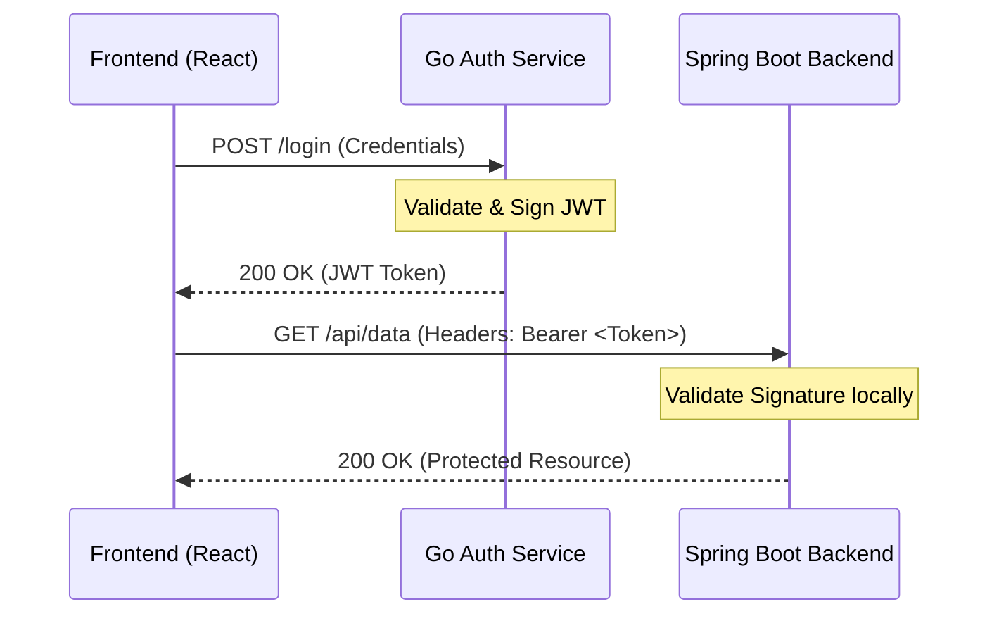

# Go Authentication Service

A lightweight Go authentication service that validates admin credentials and issues JWT tokens.

This service is framework-minimal (`net/http`) and designed to be easy to understand, test, and integrate with multiple backend apps (for example Spring Boot APIs). 

## 🚀 Features
- **Stateless Auth**: Issues HS256 JWT tokens.
- **Lightweight**: Minimal dependency footprint.
- **Security-First**: Includes CORS middleware for frontend integration and environment-based secret management.
- **Observability**: Built-in `/health` check for container orchestration.

## 🛠 Requirements
- **Go**: 1.22+ (refer to `go.mod`)
- **Environment**: A `.env` file containing `JWT_SECRET` and `PORT`.

## 💻 Run Locally
```bash
# Install dependencies
go mod tidy

# Run the service
go run main.go
```
*Expected output: `Starting auth service on :8081`*

## 🛣 API Endpoints

### 1. Health Check
- **Method**: `GET`
- **URL**: `/health`
- **Response**: `200 OK` | `"Auth service is running"`

### 2. Login
- **Method**: `POST`
- **URL**: `/login`
- **Body**:
```json
{
  "username": "admin",
  "password": "your-password"
}
```

---

## 🔒 Security Architecture: Cross-Service Authentication

This project utilises a **Stateless JWT** architecture. Instead of a monolithic session-store, it follows the **"Sign-at-the-Gate, Verify-at-the-Resource"** pattern.

### The Handshake Protocol
1. **Authentication (Go Auth Service)**: Validates credentials and signs a JWT using a **Shared Secret Key** (HS256).
2. **Persistence (Frontend)**: React-admin stores the token and uses an **Axios Interceptor** to inject it into the `Authorization` header.
3. **Authorisation (Spring Boot Backend)**: The Java backend acts as an **OAuth2 Resource Server**. It validates the signature locally using the same Shared Secret; no cross-service call to Go is required during the request lifecycle.

### Technical Flow


### Components & Responsibilities

| Component | Responsibility | Key Tech |
| :--- | :--- | :--- |
| **Go Auth** | Credential validation & Token Signing | `net/http`, `golang-jwt`, `godotenv`|
| **Spring Backend** | Stateless Token Validation | `spring-boot-starter-oauth2-resource-server` |
| **Frontend** | Token storage & Header injection | `axios` interceptors, `react-admin` |

---

## 🗺 Roadmap
- [ ] **Persistence**: Integrate PostgreSQL/SQLite for user storage.
- [ ] **Authorisation**: Add Role-Based Access Control (RBAC) claims to JWT.
- [ ] **Security+**: Implement Refresh Token flow and Key Rotation.
- [ ] **Testing**: Add unit tests for JWT utility and handler logic.
